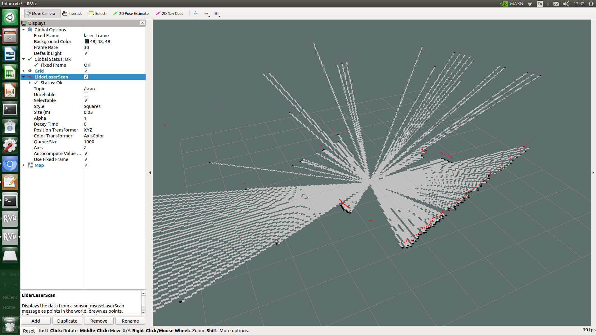

# jetson_robot

#### chmod +x catkinmake.sh
```
./catkinmake.sh
```
- ydlidar X2
- Jetson nano B01
- BTS7960

file ydlidar_ros ได้รับการเเก้ไขเเล้วให้เป็น X2 ถ้าจะใช้รุ่นอื่นต้องทำการเเก้ไขใหม่
## SLAM - ydlidar X2
```
sudo apt install ros-melodic-hector-slam
```
add file slam.launch
```
<launch>
  <node name="ydlidar_node"  pkg="ydlidar_ros"  type="ydlidar_node" output="screen" respawn="false" >
    <param name="port"         type="string" value="/dev/ttyUSB0"/>  
    <param name="baudrate"         type="int" value="115200"/>  
    <param name="frame_id"     type="string" value="laser_frame"/>
    <param name="resolution_fixed"    type="bool"   value="true"/>
    <param name="auto_reconnect"    type="bool"   value="true"/>
    <param name="reversion"    type="bool"   value="false"/>
    <param name="angle_min"    type="double" value="-180" />
    <param name="angle_max"    type="double" value="180" />
    <param name="range_min"    type="double" value="0.1" />
    <param name="range_max"    type="double" value="16.0" />
    <param name="ignore_array" type="string" value="" />
    <param name="frequency"    type="double" value="10"/>
    <param name="isTOFLidar"    type="bool"   value="false"/>
    <param name="isSingleChannel"    type="bool"   value="true"/>
  </node>
  <node pkg="tf" type="static_transform_publisher" name="base_link_to_laser4"
    args="0.2245 0.0 0.2 0.0 0.0  0.0 /base_footprint /laser_frame 40" />
     <node pkg ="tf" type="static_transform_publisher" name="map_to_odom" args="0.0 0.0 0.0 0.0 0.0 0.0 /map /nav 40"/>

     <node pkg ="tf" type="static_transform_publisher" name="odom_to_base_link" args="0.0 0.0 0.0 0.0 0.0 0.0 /nav /base_footprint 40"/>

     <include file="$(find hector_mapping)/launch/mapping_default.launch" />

     <node pkg="rviz" name="rviz" type="rviz" args="-d $(find ydlidar_ros)/launch/lidar.rviz" />

     <include file="$(find hector_geotiff)/launch/geotiff_mapper.launch" />
</launch>
```
run slam.launch and rviz add map

Save map
```
rosrun map_server map_saver -f 'file'
```
<p align="center">

</p>
